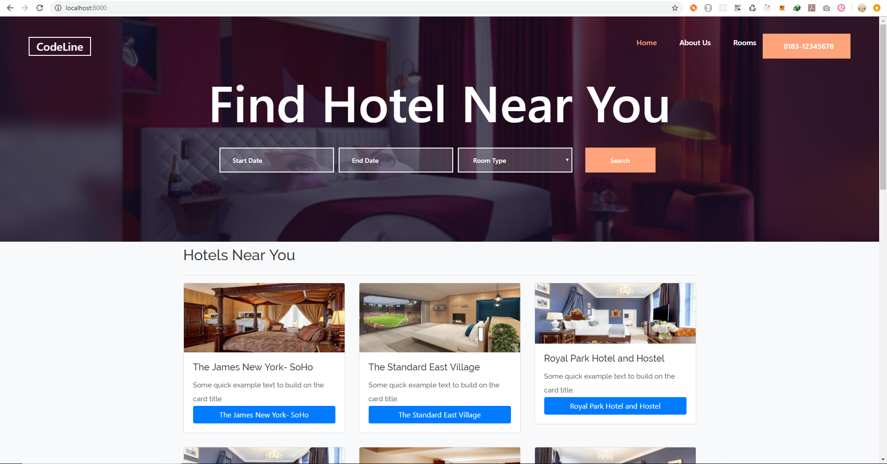
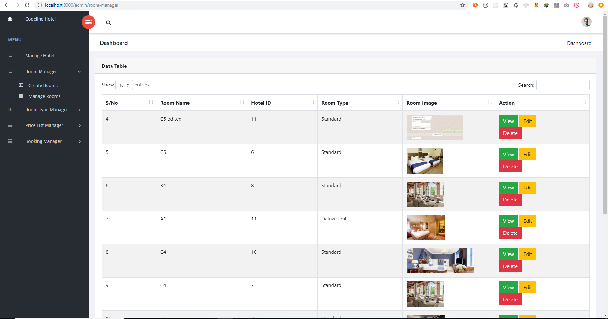
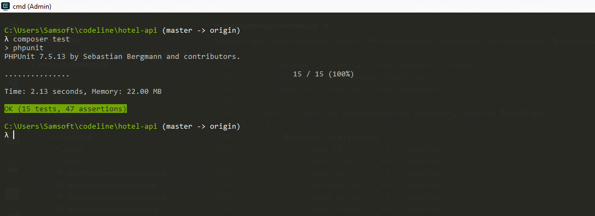

# 22107. Test Assignment for Laravel _ Frontend 

https://app.codeline.io/#/projects/2068/tasks/22107

## About Codeline Hotel Management System
Codeline Hotel Management System (CHML) is a web application develop using Laravel and VueJs framework, with expressive, elegant syntax.
CHML takes the pain out of Hoteliers by easing their Booking process and Customer management, such as:

- Room Manager
- Room Type Manager
- Price List Manager
- Booking Manager

## CHML Homepage
<div align="center">
    
</div>

## CHML Backend Page
<div align="center">
    
</div>

## CHML Setup
Setup is pretty simple, foremost you need to have the following installed on your environment, currently using window, you can search on how to set it up on other OS.
1. Node && Node Package Manager <br/>
2. Php && Composer <br/>
3. Xampp/Wamp <br/>
4. Nagivate to your localhost http://127.0.0.1/phpmyadmin, create database called "codeline" then <br/>
5. Open your bash or CMD, ensure you have git install on your workstation, clone the repo below <br/>
    ```git clone http://gitlab.gitesoft.com/test-assignments-v2/22107-test-assignment-for-laravel-_-frontend.git ``` <br/>
6. Once you successfully clone the repo, cd into the directory and run the following commad <br/>
7. In the project directory, run <br/>
    ``` npm install ``` => this will install <br/>
    ``` composer install ``` => This will install Laravel Dependencies
8. Before you procced, go to .env file in the project directory, change database connection parameters to fit into your configuration <br/>
    ``` php artisan migrate ```  => Create database table <br/>
    ``` php artisan db:seed ``` => Load seeders ( You can modified this in database/seeds/DatabaseSeeder.php) <br/>
9. If you're able to run the above successfully, congratulation, next, you should run the passport:install command. This command will create the encryption keys needed to generate secure access tokens. In addition, the command will create "personal access" and "password grant" clients which will be used to generate access tokens: <br/>
    ``` php artisan passport:install ``` <br/>
10. After you've run the command, it'll print some data into your screen, use the second value to update the following params in your environment configuration (.env) 
<br/>
MIX_CLIENT_ID=2 <br/>
MIX_CLIENT_SECRET=eDwaB2ZpgU62Wp21o3RB8I5yL6hZzC9FR2qM1TrK <br/>

11. Run ```npm run dev ``` <br/>
12. Finally, run the following command in your project directory to boot up the server. <br/>
    ``` php artisan serve ``` <br/>
then go to <br/>
    http://127.0.0.1:8000 => Home Page <br/>
    http://127.0.0.1:8000/admin/room-manager => Administrator Page <br/>

## Admin Login Credential
<table>
    <tr>
        <th>Email Address</th>
        <td> admin@codelinehotel.io </td>
    </tr>
    <tr>
        <th>Password</th>
        <td> password </td>
    </tr>
</table>

## Testing Instructions
1. Create ```.env.testing``` file with the following params

``` javascript
    APP_NAME=Laravel
    APP_ENV=testing
    APP_KEY=base64:5CpEFQ9UTR543dbJUsT3araoSSyxuN8NF92gCJJXpk8=
    APP_DEBUG=true
    APP_URL=http://127.0.0.1:8000

    LOG_CHANNEL=stack

    DB_CONNECTION=sqlite
    DB_DATABASE=./database/test.sqlite

    BROADCAST_DRIVER=log
    CACHE_DRIVER=array
    SESSION_DRIVER=array
    SESSION_LIFETIME=120
    QUEUE_DRIVER=sync

    MAIL_DRIVER=array
    
    MIX_CLIENT_ID=2
    MIX_CLIENT_SECRET=tCVvCTZjuH1h1rCGNufX2ZGqRAcS3LS3R95u2DEZ    
```
2. Create ```database/test.sqlite ``` and then update the path in ```.env.testing``` 
3. Next, because we're going to make use of the seeder, run the following command and specify the env
    ```php artisan migrate --seed --env=testing```
4. Run ```php artisan passport:install --env=testing ``` and copy to replace the below in your ```.env.testing```'

    ``` javascript 
   MIX_CLIENT_ID=2
   MIX_CLIENT_SECRET=tCVvCTZjuH1h1rCGNufX2ZGqRAcS3LS3R95u2DEZ 
   ```
4. Run test ```composer test``` <br/>

## Test Console
<div align="center">
    
</div>

If you've any issue setting this up, will be available to help out.